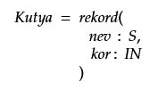
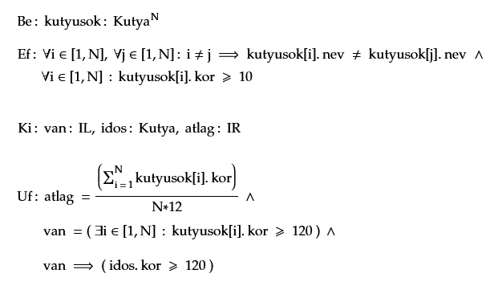

# Kiskedvencek tIKtos élete

## Információk 
Beadás:  
- egy darab cpp file 
- E-mail cím: mohmas@inf.elte.hu
- Tárgy:  [ PROG ] - ZH *Saját Neved* (pl.: [ PROG ] - ZH Szőrmók Tamás )

## Feladat

### Lore
Egy család rengeteg kiskedvencet fogadott örökbe, és ők további kiskedvenceket gyártottak, és mostanra elég nehéz lett számon tartani ezt a nagy falkát.


Van egy halom kutyusunk, mindegyiknek ismerjük a nevét és az életkorát (hónapban). Add meg, hogy mi a kutyusok átlagéletkora, illetve, hogy van-e 10 évnél (120 hónap) idősebb kutya, és ha igen, ki az.
- Minden név egyedi
- Minden kutya legalább 10 hónapos
- A bemenet elején megadhatod, hogy hány kutya lesz, de dolgozhatsz akár fix hosszúságú vektorral is

### Pontozás

Kötelező legalább az egyik (nincs nélküle elégséges, hiába van meg a többi):
- A kimenetre helyesen kiírod, hogy mi a kutyák átlagéletkora tört években! (1.5 pont)
- A kimenetre helyesen kiírod, hogy van-e olyan kutya, aki 10 évnél idősebb, és ha van, a nevét is (2.5 pont)

További pontok:
- Nem egy beégetett vektorban vannak az adatok, hanem a konzolról olvasod be őket. Érdemes ilyenkor az adatok számát beolvasni először! (1 pont)
- A beolvasáskor ellenőrzöd, hogy nem lehet kétszer ugyanaz a név. Itt még elég, ha ilyenkor leáll a program, vagy egyszerűen átugrod ezt az adatot, és nem adod a vektorhoz (tehát kevesebb lesz a bemeneti adatod). (1 pont)
- A beolvasáskor ellenőrzöd, hogy minden kutya kora legalább 10 hónap. Itt is elég úgy, mint előbb. (1 pont)
- Ha hibás bemenet volt (létező név/túl fiatal kutya), akkor újra kérd be az aktuális kutyust, tehát nem átugrod/leáll a program. Ez azt jelenti, hogy ha 5 kutyát adna meg eleve, de egyet elront, akkor 6 bementi sor lesz, amiből 5 került a vektorba. (1 pont)
- Ha lefutott a feladat, és kiírta az eredményt, a program kérdezze meg, hogy újra le szeretné futtatni más adatokkal (amiket újra bekérünk), vagy lépjen ki (1 pont)

Tehát max 10 pont szedhető össze, de ha nem oldod meg legalább az egyik kötelezőt, akkor elégtelen a ZH.


  



### Bemenet és kimenet
Én itt egy tömbméret bekérése után `név  életkor` sorrendben adom meg a kutyákat (nem tudok kutyaneveket, nézzétek el nekem) . A kimenetnek nem muszáj ilyen formátumúnak lenni, lehet akár csak annyi, hogy 3.6 volt Istvan.  
#### Sima bemenet, nincs öreg kutya
````
Be:
5
Áron 25
Nándor 56
István 17
Gergő 48
Péter 70

Ki:
Átlag életkor: 3.6 év
Nem volt 10 évnél idősebb kutya
````
#### Sima bemenet, van öreg kutya
````
Be:
5
Áron 25
Nándor 56
István 170
Gergő 48
Péter 70

Ki:
Átlag életkor: 6.15 év
Volt 10 évnél idősebb kutya, pl.: István
````
#### Sima bemenet, van több öreg kutya is
````
Be:
5
Áron 125
Nándor 56
István 170
Gergő 190
Péter 70

Ki:
Átlag életkor: 10.183 év
Volt 10 évnél idősebb kutya, pl.: Áron
````
#### Rossz bemenet (duplikált név) újra bekéréssel
````
Be:
5
Áron 25
Nándor 56
Áron 25
Áron 120
Áron 57984
István 17
Gergő 48
Péter 70

Ki:
Átlag életkor: 3.6 év
Nem volt 10 évnél idősebb kutya
````
#### Rossz bemenet (túl fiatal kutya) újra bekéréssel
````
Be:
5
Áron 25
Nándor 56
Dalma 5
Erik 0
László -4845
István 17
Gergő 48
Péter 70

Ki:
Átlag életkor: 3.6 év
Nem volt 10 évnél idősebb kutya
````