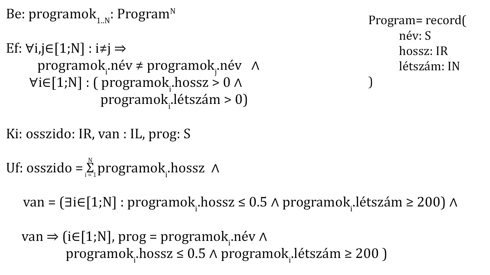

# Állati programok

## Információk 
Beadás: egy darab cpp file (main.cpp-t nevezd át a Neptun-kódodra, pl.: mohmas.cpp)

## Feladat

### Lore
Rutit, a Nyíregyházi Állatpark fiatal borneói orángután kölykét már ismerjük. Ruti rendszeresen jár el az Állatpark közgyűlésébe, ahol aktívan részt vesz az érdekképviseleti rendszer működésében. Ruti a Látogatószórakoztatási Bizottság tagja, és az Attrakciók munkacsoportot vezeti, tehát programokat szervez. Minden programnak ismerjük
- a nevét (string, egyedi),
- a várt látogatószámát (egész szám, pozitív),
- az időtartamát órákban (tört szám, pozitív)

Ruti két dolgot szeretne kideríteni.
- Mennyi idő lenne az összes programon részt venni?
- Van olyan program, ami legfeljebb fél órás, de 200 embert lefoglal? Melyik az?


### Pontozás

Kötelező legalább az egyik (nincs nélküle elégséges, hiába van meg a többi):
- A kimenetre helyesen kiírod, mennyi idő lenne az összes programon részt venni! (2 pont)
- A kimenetre helyesen kiírod, hogy volt-e legfeljebb fél órás, de 200 vendéget lefoglaló program, és ha volt, annak a nevét is! (3 pont)

További pontok:
- Nem egy beégetett vektorban vannak az adatok, hanem a konzolról olvasod be őket. Érdemes ilyenkor az adatok számát beolvasni először! (1 pont)
- A beolvasáskor ellenőrzöd, hogy nem lehet kétszer ugyanaz a programnév. Itt még elég, ha ilyenkor leáll a program, vagy egyszerűen átugrod ezt az adatot, és nem adod a vektorhoz (tehát kevesebb lesz a bemeneti adatod). (1 pont)
- A beolvasáskor ellenőrzöd, hogy minden program látogatószáma és időtartama pozitív. Itt is elég úgy, mint előbb. (1 pont)
- Ha hibás bemenet volt (létező név/túl rövid program), akkor újra kérd be az aktuális programot, tehát nem átugrod/leáll a program. Ez azt jelenti, hogy ha 5 programot adna meg eleve, de egyet elront, akkor 6 bementi sor lesz, amiből 5 került a vektorba. (1 pont)
- Ha lefutott a feladat, és kiírta az eredményt, a program kérdezze meg, hogy újra le szeretné futtatni más adatokkal (amiket újra bekérünk), vagy lépjen ki (1 pont)

Tehát max 10 pont szedhető össze, de ha nem oldod meg legalább az egyik kötelezőt, akkor elégtelen a ZH.





### Bemenet és kimenet
Én itt egy tömbméret bekérése után `név hossz létszám` sorrendben adom meg a programokat. A kimenetnek nem muszáj ilyen formátumúnak lenni.  

#### Sima bemenet, nincs fél órás 200 főt befogadó program
````
Be:
5
Delfin_etetes 0.5 5
Jeep_szafari 3 50
Sarkanyrepules_sarkanyokkal 1.5 10
Yeti_leses 2 10
Capa_kaland 0.2 1

Ki:
Ossz: 7.2
Nincs ilyen program
````
#### Sima bemenet, van fél órás 200 főt befogadó program
````
Be:
5
Delfin_etetes 0.5 5
Jeep_szafari 3 50
Sarkanyrepules_sarkanyokkal 1.5 10
Bivaly_parzas 0.5 250
Capa_kaland 0.2 1

Ki:
Ossz: 5.7
Van ilyen program: Bivaly_parzas
````
#### Rossz bemenet (duplikált név) újra bekéréssel
````
Be:
5
Delfin_etetes 0.5 5
Jeep_szafari 3 50
Sarkanyrepules_sarkanyokkal 1.5 10
Sarkanyrepules_sarkanyokkal 0.5 1000
Sarkanyrepules_sarkanyokkal 100 5
Bivaly_parzas 0.5 250
Capa_kaland 0.2 1

Ki:
Ossz: 5.7
Van ilyen program: Bivaly_parzas
````
#### Rossz bemenet (negatív látogatószám vagy időtartam) újra bekéréssel
````
Be:
5
Delfin_etetes 0.5 5
Jeep_szafari 3 50
Sarkanyrepules_sarkanyokkal 1.5 10
Kvantum_allatok -2 300
Bivaly_parzas 0.5 250
Thanos_kaland 3 -600000000
Capa_kaland 0.2 1

Ki:
Ossz: 5.7
Van ilyen program: Bivaly_parzas
````