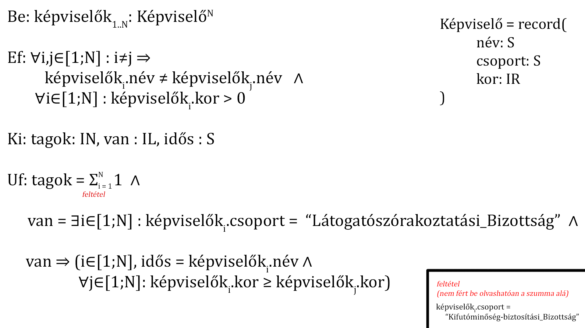

# Állati demokrácia

## Információk 
Beadás: egy darab cpp file (main.cpp-t nevezd át a Neptun-kódodra, pl.: mohmas.cpp)

## Feladat

### Lore
Rutit, a Nyíregyházi Állatpark fiatal borneói orángután kölykét már ismerjük. Ruti rendszeresen jár el az Állatpark közgyűlésébe, ahol aktívan részt vesz az érdekképviseleti rendszer működésében. Rutinak számos képviselőtársa van, mindegyiküknek ismerjük
- a nevét (string, egyedi),
- a munkacsoportja nevét (string, szóköz nélkül),
- az életkorát (törtszám években, pozitív).
Szeretnénk megtudni, hogy hányan tevékenykednek a Kifutóminőség-biztosítási Bizottságban, illetve, hogy ki a legidősebb tagja a Látogatószórakoztatási Bizottságnak.

### Pontozás

Kötelező legalább az egyik (nincs nélküle elégséges, hiába van meg a többi):
- A kimenetre helyesen kiírod, hogy hány tagja van a `Kifutóminőség-biztosítási_Bizottság` csoportnak! (2 pont)
- A kimenetre helyesen kiírod, hogy mi a neve a `Látogatószórakoztatási_Bizottság` legidősebb tagjának, vagy azt, hogy nincs ilyen bizottság! (2+1 pont)
    - Ha van legalább egy tagja a `Látogatószórakoztatási_Bizottság` csoportnak, akkor kiírod a **legidősebb tag nevét**: 2 pont
    - Ha nincs egy tagja sem a `Látogatószórakoztatási_Bizottság` csoportnak, akkor kiírod, hogy **Nincs LSzBiz**: 1 pont

További pontok:
- Nem egy beégetett vektorban vannak az adatok, hanem a konzolról olvasod be őket. Érdemes ilyenkor az adatok számát beolvasni először! (1 pont)
- A beolvasáskor ellenőrzöd, hogy nem lehet kétszer ugyanaz a név. Itt még elég, ha ilyenkor leáll a program, vagy egyszerűen átugrod ezt az adatot, és nem adod a vektorhoz (tehát kevesebb lesz a bemeneti adatod). (1 pont)
- A beolvasáskor ellenőrzöd, hogy minden képviselő kora meghaladja a 0 évet. Itt is elég úgy, mint előbb. (1 pont)
- Ha hibás bemenet volt (létező név/túl fiatal képviselő), akkor újra kérd be az aktuális képviselőt, tehát nem átugrod/leáll a program. Ez azt jelenti, hogy ha 5 képviselőt adna meg eleve, de egyet elront, akkor 6 bementi sor lesz, amiből 5 került a vektorba. (1 pont)
- Ha lefutott a feladat, és kiírta az eredményt, a program kérdezze meg, hogy újra le szeretné futtatni más adatokkal (amiket újra bekérünk), vagy lépjen ki (1 pont)

Tehát max 10 pont szedhető össze, de ha nem oldod meg legalább az egyik kötelezőt, akkor elégtelen a ZH.





### Bemenet és kimenet
Én itt egy tömbméret bekérése után `név csoport életkor` sorrendben adom meg a képviselőket. A kimenetnek nem muszáj ilyen formátumúnak lenni.  

#### Sima bemenet, nincs öreg képviselő
````
Be:
5
Gergő Kifutóminőség-biztosítási_Bizottság 15
Áron Nemzetközi_Állatközösség 9.5
Nándor Nemzetközi_Állatközösség 6
Péter Kifutóminőség-biztosítási_Bizottság 11.7
István Kifutóminőség-biztosítási_Bizottság 8

Ki:
KmbBiz: 3 tag
Nincs LSzBiz
````
#### Sima bemenet, van öreg képviselő
````
Be:
5
Gergő Kifutóminőség-biztosítási_Bizottság 15.9
Áron Nemzetközi_Állatközösség 9
Nándor Látogatószórakoztatási_Bizottság 6
Péter Kifutóminőség-biztosítási_Bizottság 11
István Látogatószórakoztatási_Bizottság 8.2

Ki:
KmbBiz: 2 tag
Legidősebb LSzBiz tag: István
````
#### Rossz bemenet (duplikált név) újra bekéréssel
````
Be:
5
Gergő Kifutóminőség-biztosítási_Bizottság 15
Áron Nemzetközi_Állatközösség 9
Nándor Látogatószórakoztatási_Bizottság 6
Nándor Látogatószórakoztatási_Bizottság 199.7
Nándor Látogatószórakoztatási_Bizottság 2498
Péter Kifutóminőség-biztosítási_Bizottság 11
Péter Kifutóminőség-biztosítási_Bizottság 27
Péter Kifutóminőség-biztosítási_Bizottság 14
István Látogatószórakoztatási_Bizottság 8.0

Ki:
KmbBiz: 2 tag
Legidősebb LSzBiz tag: István
````
#### Rossz bemenet (túl fiatal képviselő) újra bekéréssel
````
Be:
5
Gergő Kifutóminőség-biztosítási_Bizottság 15
Áron Nemzetközi_Állatközösség 9.6
Nándor Látogatószórakoztatási_Bizottság 6
László Látogatószórakoztatási_Bizottság -672.15
Péter Kifutóminőség-biztosítási_Bizottság 11
Dalma Kifutóminőség-biztosítási_Bizottság -0.1
István Látogatószórakoztatási_Bizottság 8

Ki:
KmbBiz: 2 tag
Legidősebb LSzBiz tag: István
````